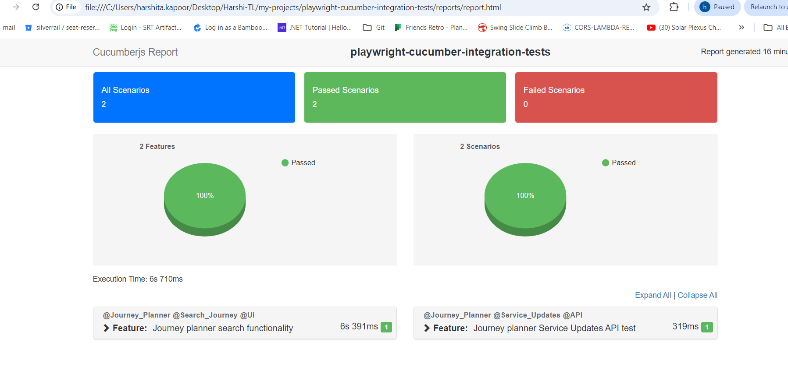

# playwright-cucumber-integration-tests

Playwright (JS) automation test suite using cucumber BDD framework

## Features

1. Playwright with cucumber integration
2. Generate test reports
3. Generates test logs ( each scenario has seperate log folder, making it easy to debug )
4. Both UI and API tests using playwright robust library
5. Tests run on multiple environments
6. Parallel execution of tests
7. Failed tests rerun functionalit
8. Page object model implemented for easy maintainence
9. Github actions

# Project structure

- .github > execute tests on CI
- features > cucumber test scenarios with step defination and hooks
- src > all helper files and page object model
- reports > cucumber html report
- logs > test logs

### Folder structure

1. `features\scenarios\*` -> cucumber feature files
2. `features\step_defs\**\*` -> cucumber step def files
3. `features\support\hooks.js` -> cucumber hooks having code for initial set up
4. `src\helper\env` -> .env files
5. `src\helper\types` -> type definations
6. `src\helper\browsers\*` -> launch browser as per ENV variable
7. `src\helper\utils\CommonAsserts` -> common asserts for pages
8. `src\helper\utils\DateHelper` -> custom date functions
9. `src\helper\utils\DateConst` -> date constants used in custom date functions
10. `src\helper\utils\logger` -> for generating logs
11. `cucumber.js` -> contains configuration for reporting and parallel execution
12. `package.json` -> Contains all the dependencies

## Get Started

### Setup:

1. `npm i` to install the dependencies
2. `npx playwright install` to install the browsers
3. `npm run test` to execute all the tests
4. `npm run test features/scenario/*.feature` to run particular feature file

### To generate custom cucumber test report

1. `npm run test`
2. `node cucumber.report.js `

Report Screenshot -

